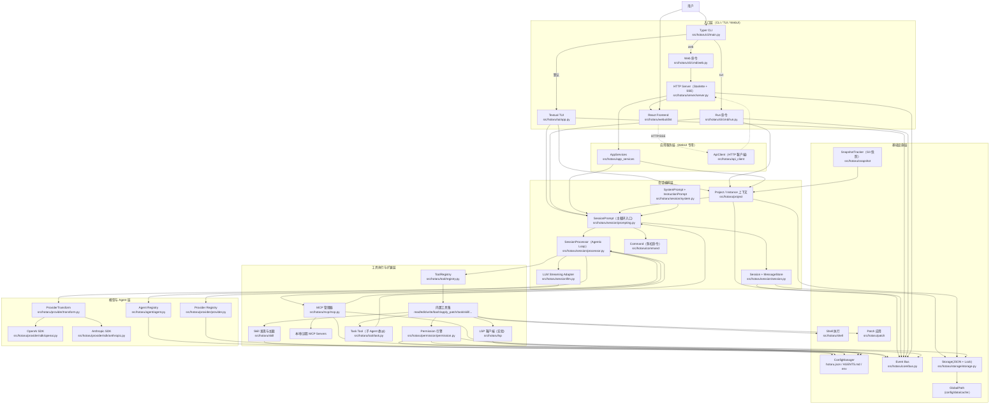

# Hotaru Code

## 架构图



Hotaru Code 是一个 AI 编码助手。

它提供 TUI、WebUI 与一次性 Run 模式，并支持工具调用、权限控制、会话持久化、MCP 扩展、Skill 与 Agent 配置。

## 功能介绍

### 1. 多种交互模式

- `hotaru`：默认进入 TUI（Textual）
- `hotaru web`：启动 WebUI（HTTP + SSE）
- `hotaru run "你的需求"`：一次性执行
- 支持内置 `/init` 命令：自动生成/更新 `AGENTS.md`

### 2. Agent + 权限体系

- 内置 Agent：`build`、`plan`、`general`、`explore`（以及内部隐藏 agent）
- 支持通过 `hotaru agent create` 生成 Markdown Agent 配置
- 支持加载 `.opencode/agents/`、`.hotaru/agents/` 等路径下的 Markdown Agent
- 权限规则支持 `allow / ask / deny`
- 对敏感能力（如 `bash`、`edit`、外部目录访问等）可细粒度控制
- 内置重复调用保护（doom loop）

### 3. 工具调用能力

内置工具（按功能分组）：

- 文件与代码：`list`、`glob`、`grep`、`read`、`edit`、`write`、`multiedit`、`apply_patch`
- 执行与编排：`bash`、`task`、`todoread`、`todowrite`、`question`
- 外部信息：`webfetch`
- 扩展能力：`skill`、`lsp`（实验开关）
- 实验工具：`websearch`、`codesearch`、`batch`、`plan_enter`、`plan_exit`

说明：

- `websearch / codesearch` 需要 `experimental.enable_exa = true`
- `lsp` 需要 `experimental.lsp_tool = true`
- `batch` 需要 `experimental.batch_tool = true`
- `plan_enter / plan_exit` 需要 `experimental.plan_mode = true`
- 不同模型下会自动调整编辑工具（如 `apply_patch` 与 `edit/write` 的切换）

### 4. Provider / MCP / Skill 扩展

- Provider：支持 OpenAI、Anthropic 与 OpenAI-compatible 自定义服务
- MCP：支持本地（stdio）和远程（HTTP/SSE）MCP，支持 OAuth 场景
- Skill：支持本地目录发现，也支持远程技能索引拉取
- 会话持久化：会话/消息存储为本地 JSON，可恢复历史上下文

## 安装与启动

### 1. 在本仓库源码使用（开发场景）

```bash
uv sync
uv run hotaru --help
uv run hotaru
```

### 2. 作为命令行工具安装（已发布场景）

```bash
uv tool install hotaru-code
uv tool update-shell
hotaru --help
```

可选：

```bash
uvx --from hotaru-code hotaru --help
```

### 3. 配置 API Key

至少配置一个可用 Provider 的密钥（或使用`/connect`命令连接自定义API）：

```bash
# macOS/Linux
export OPENAI_API_KEY="your-key"
# 或
export ANTHROPIC_API_KEY="your-key"
```

```powershell
# Windows PowerShell
$env:OPENAI_API_KEY = "your-key"
# 或
$env:ANTHROPIC_API_KEY = "your-key"
```

## 使用方法

### 1. TUI 模式

```bash
# 默认进入 TUI
hotaru

# 指定模型/agent
hotaru --model openai/gpt-5 --agent build

# 切换工作目录并带初始 prompt
hotaru --directory ../another-repo --prompt "先阅读项目结构并总结"

# 显式使用 tui 子命令
hotaru tui --continue
```

### 2. Run 模式（一次性）

```bash
# 基础
hotaru run "请分析这个仓库的结构"

# 指定模型/agent/自动通过权限
hotaru run "修复 tests 失败" --model openai/gpt-5 --agent build --yes

# 附加文件（可重复 -f）
hotaru run "根据附件生成发布说明" -f CHANGELOG.md -f docs/release.md

# 输出 JSON 事件流
hotaru run "总结这段日志" --json

# 触发内置 /init
hotaru run "/init 请补充 monorepo 规范"

# 从 stdin 追加输入
cat error.log | hotaru run "总结错误并给修复建议"
```

### 3. WebUI 模式

```bash
# 启动 WebUI（默认绑定 127.0.0.1:4096）
hotaru web

# 自定义 host/port，并自动打开浏览器
hotaru web --host 127.0.0.1 --port 4096 --open
```

若你在源码仓库开发前端：

```bash
cd frontend
npm ci
npm run build
```

构建产物会直接输出到 `src/hotaru/webui/dist`，然后回到项目根目录运行 `hotaru web`。
PyPI 发布流程会在 `uv build` 前自动执行这一步，无需手工同步前端产物。

### 4. 会话与配置管理

```bash
hotaru providers            # 列出已可用 provider/model
hotaru agents               # 列出可见 agent
hotaru sessions -n 20       # 列出最近会话
hotaru config --show        # 展示合并后的配置
hotaru config --path        # 展示配置目录

hotaru run "继续处理上次任务" -c
hotaru run "继续指定会话" -s <session_id>

hotaru agent list
hotaru agent create --description "Review Python code and propose safe refactors" --mode primary
```

### 4. LSP 调试命令

```bash
# 查询某个文件的 LSP diagnostics（JSON 输出）
hotaru debug lsp diagnostics src/main.py
```

## 配置说明

Hotaru 会合并多来源配置（后者覆盖前者）：

1. 全局配置目录（可用 `hotaru config --path` 查看）
2. 当前目录向上查找的 `hotaru.json` / `hotaru.jsonc`
3. 当前目录向上查找的 `.hotaru/hotaru.json` / `.hotaru/hotaru.jsonc`（含 `~/.hotaru`）
4. 环境变量 `HOTARU_CONFIG_CONTENT`
5. 托管配置目录（最高优先级）

### 最小 `hotaru.json` 示例

```json
{
  "model": "openai/gpt-5",
  "default_agent": "build",
  "provider": {
    "openai": {
      "options": {
        "apiKey": "{env:OPENAI_API_KEY}"
      }
    }
  },
  "permission": {
    "bash": "ask",
    "edit": "ask",
    "read": {
      "*.env": "ask",
      "*.env.*": "ask",
      "*.env.example": "allow"
    }
  },
  "permission_memory_scope": "session",
  "continue_loop_on_deny": false
}
```

### 权限记忆与 HITL 行为配置

- `permission_memory_scope`：控制权限弹窗里选择 `always` 后的记忆范围，默认 `session`。
- `continue_loop_on_deny`：当用户拒绝权限/问题时，是否继续当前执行循环，默认 `false`（立即停止当前轮）。

`permission_memory_scope` 可选值：

- `turn`：`always` 仅对当前请求生效，不记忆到后续步骤。
- `session`：记忆到当前会话（默认）。
- `project`：记忆到同一项目内的所有会话（仅内存态，进程重启后清空）。
- `persisted`：与 `project` 相同，但会持久化到本地存储，重启后仍可复用。

推荐配置示例：

```json
{
  "permission_memory_scope": "persisted",
  "continue_loop_on_deny": false
}
```

### 实验功能开关示例

```json
{
  "experimental": {
    "plan_mode": true,
    "enable_exa": false,
    "lsp_tool": false,
    "batch_tool": false
  }
}
```

### 自定义 OpenAI-compatible Provider 示例

```json
{
  "provider": {
    "my-provider": {
      "type": "openai",
      "name": "My Provider",
      "options": {
        "baseURL": "https://api.example.com/v1",
        "apiKey": "{env:MY_PROVIDER_API_KEY}"
      },
      "models": {
        "my-model": {
          "name": "My Model"
        }
      }
    }
  }
}
```

### MCP 示例（本地服务）

```json
{
  "mcp": {
    "filesystem": {
      "type": "local",
      "command": [
        "npx",
        "-y",
        "@modelcontextprotocol/server-filesystem",
        "."
      ],
      "enabled": true,
      "timeout": 30
    }
  }
}
```

### Markdown Agent 示例（`.opencode/agents/reviewer.md`）

```markdown
---
description: Use this agent when you need strict code review.
mode: primary
model: openai/gpt-5
tools:
  bash: false
  edit: false
---
You are a reviewer agent. Focus on correctness, regression risk, and test gaps.
```

## 项目结构

- `src/hotaru/cli/`：CLI 入口与子命令
- `src/hotaru/tui/`：Textual TUI
- `src/hotaru/session/`：会话、消息与执行循环（`SessionPrompt.loop + SessionProcessor`）
- `src/hotaru/tool/`：内置工具与注册中心
- `src/hotaru/provider/`：Provider 与模型抽象
- `src/hotaru/mcp/`：MCP 客户端与认证
- `src/hotaru/permission/`：权限规则与交互
- `src/hotaru/skill/`：Skill 发现与加载
- `src/hotaru/lsp/`：LSP 客户端与服务管理

## 会话架构（当前）

- 外层编排：`SessionPrompt.prompt()/loop()` 负责多轮循环、compaction、structured output、工具解析与策略注入
- 单轮执行：`SessionProcessor.process_step()` 只处理一次流式响应与工具执行
- 主消息模型：`session/message_store.py`（message + part 分离存储）
- Provider 语义对齐：`provider/transform.py` 统一消息归一化、tool-call id、provider 选项映射与缓存提示注入

## 开发

```bash
# 运行测试
uv run pytest tests

# 构建包
uv build
```

## 说明

- Python 版本要求：`>=3.12`
- 包名：`hotaru-code`
- 命令行入口：`hotaru`
