# Hotaru Code

AI-powered coding agent with TUI, WebUI, and one-shot CLI interfaces. Supports multi-provider LLM integration, 20+ built-in tools, MCP protocol extensions, configurable permission system, and multi-agent orchestration.

---

## Architecture Diagrams

### 1. System Architecture Overview

Full-stack layered architecture from user interfaces down to storage.

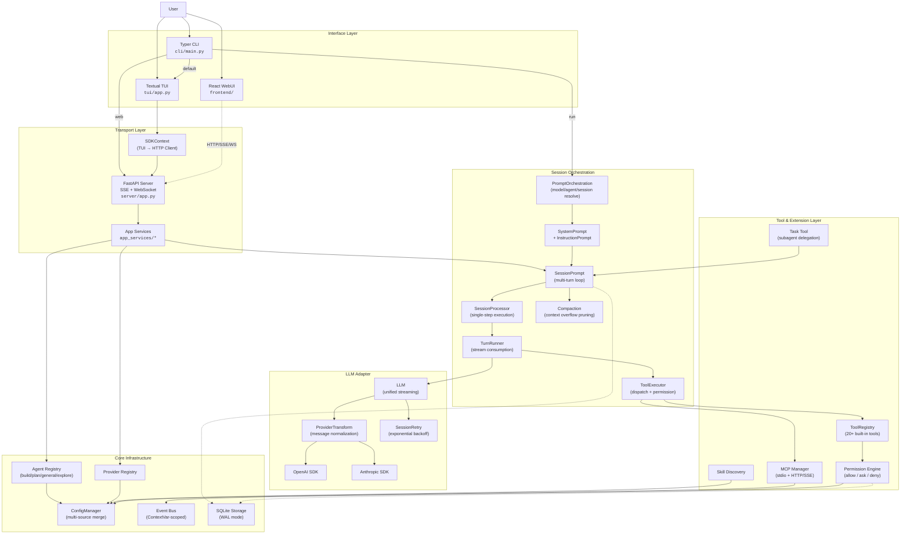

### 2. Agentic Loop — Session Processing Sequence

The core ReAct loop: the LLM generates text/tool-calls, tools execute, results feed back until completion.

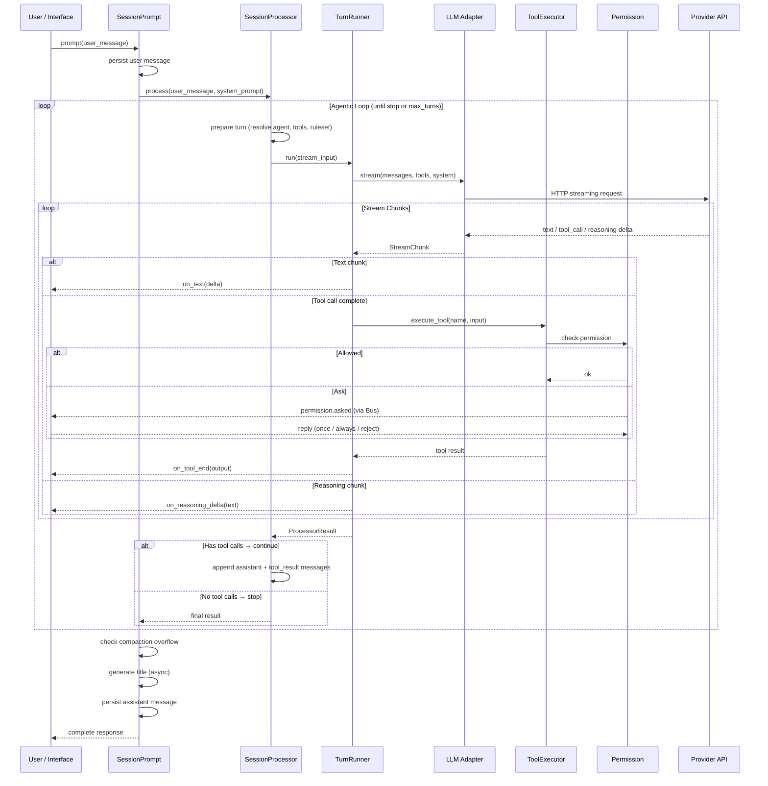

### 3. Multi-Interface Architecture

Three interfaces sharing one backend through different transport paths.

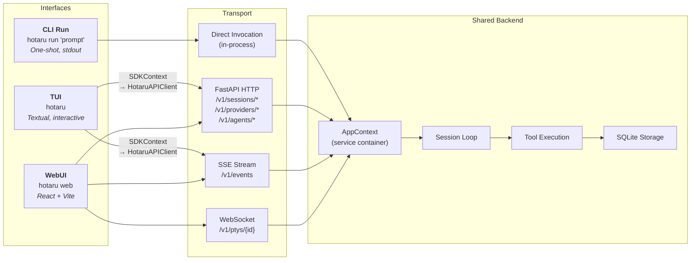

### 4. Tool Execution Pipeline

From LLM tool_call to execution result, including permission check and doom loop detection.

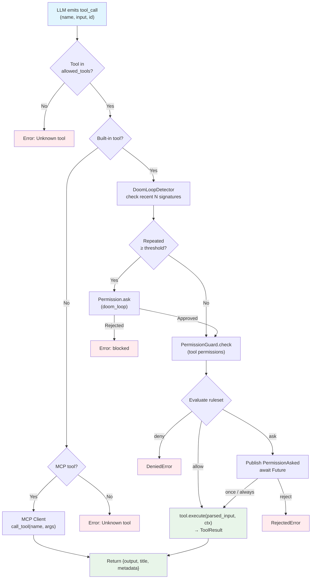

### 5. Permission System — Human-in-the-Loop Flow

Multi-scope permission memory with configurable persistence.

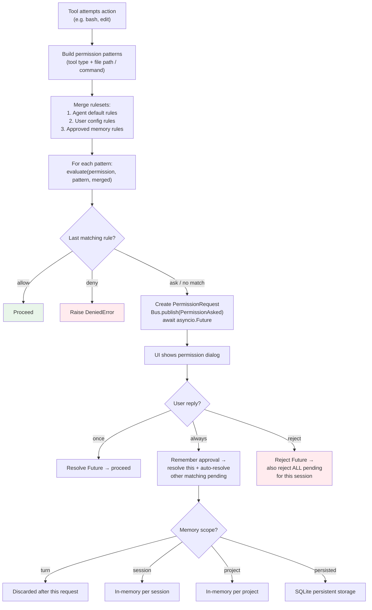

### 6. Provider Transform Pipeline

How messages are normalized across different LLM providers before API calls.

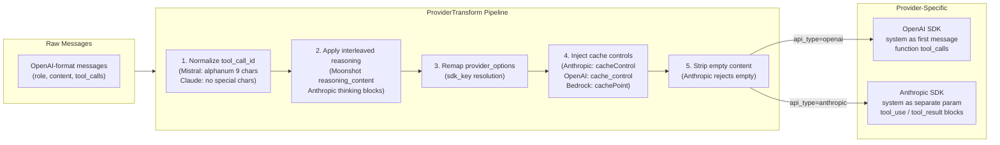

### 7. MCP Integration Architecture

Model Context Protocol client supporting local (stdio) and remote (HTTP/SSE) servers with OAuth.

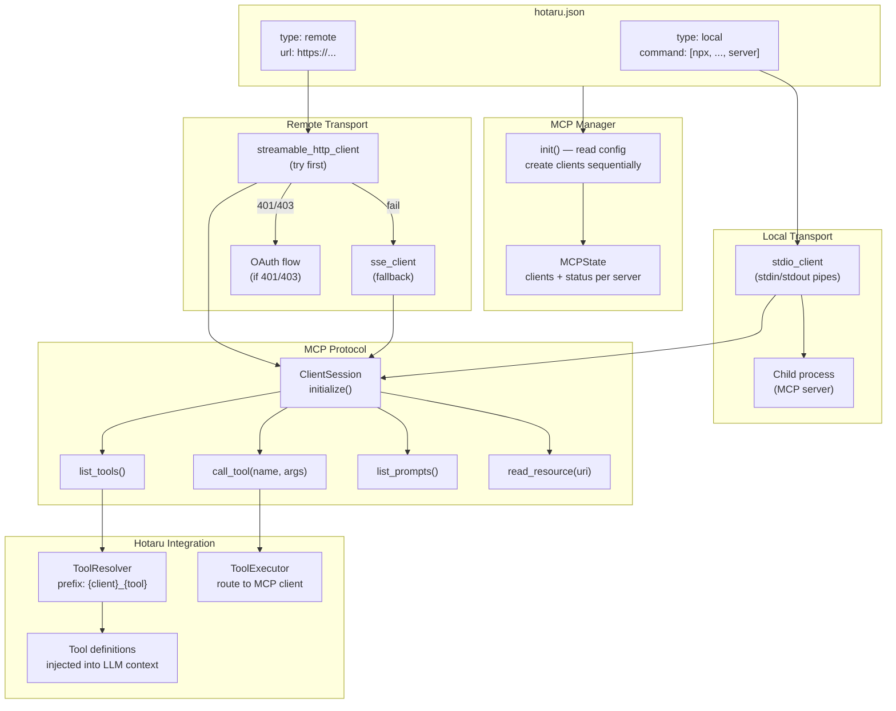

### 8. AppContext Lifecycle — Startup Sequence

Phased startup with health tracking and rollback on critical failures.

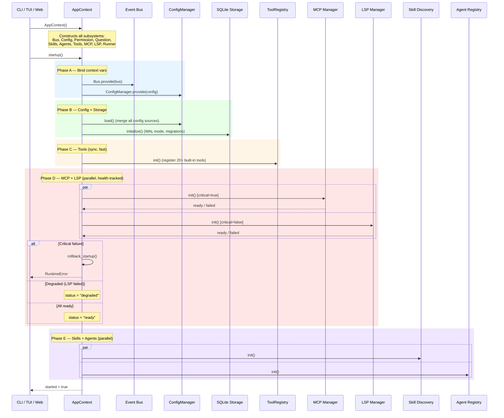

### 9. Subagent Delegation (Task Tool)

The Task tool spawns isolated child sessions with scoped agents and tool sets.

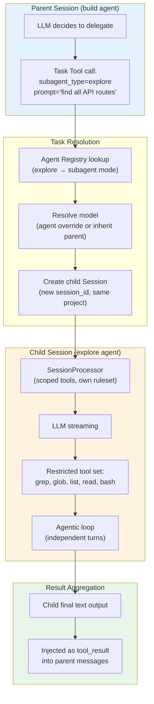

### 10. Storage Architecture

SQLite with WAL mode, namespace-routed tables, and automatic JSON migration.

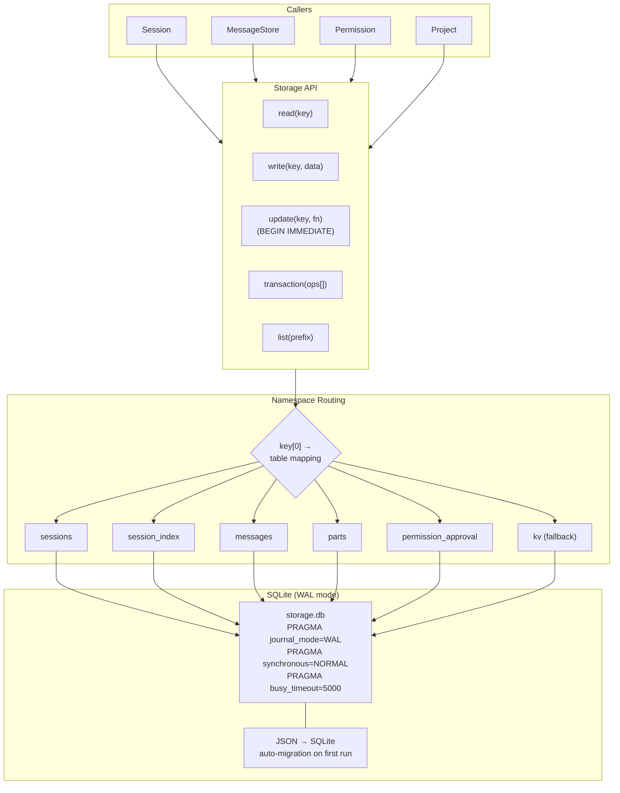

### 11. Configuration Merge Strategy

Multi-source configuration with layered priority resolution.

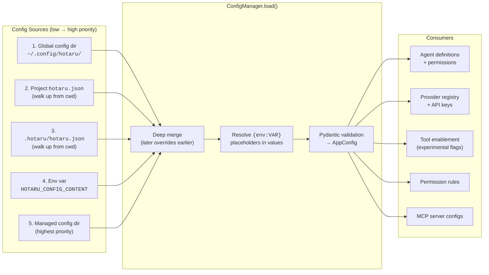

### 12. WebUI Frontend Architecture

React SPA communicating with FastAPI backend via REST + SSE.

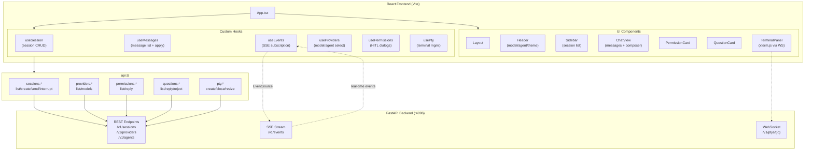

### 13. Event Bus System

ContextVar-scoped pub/sub with typed Pydantic event schemas.

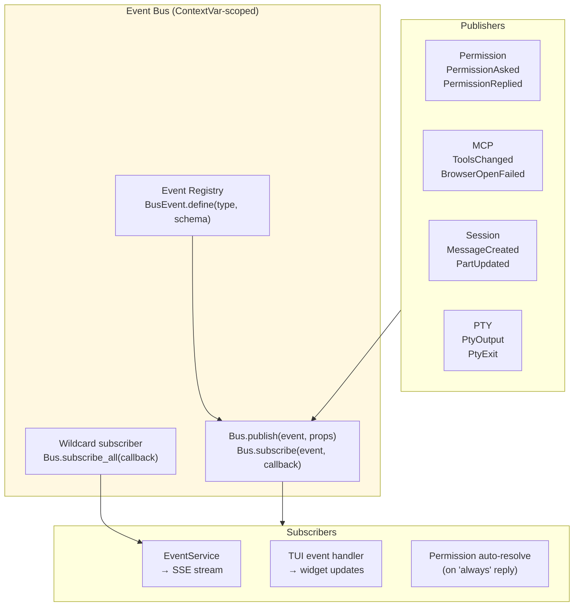

---

## Feature Overview

Hotaru Code is an AI coding assistant.

It provides TUI, WebUI, and one-shot Run mode with tool calling, permission control, session persistence, MCP extensions, LSP support, and Skill/Agent configuration.

### Multi-Interface Modes

- `hotaru` — default TUI (Textual)
- `hotaru web` — WebUI (HTTP + SSE)
- `hotaru run "your prompt"` — one-shot execution
- Built-in `/init` command for generating/updating `AGENTS.md`

### Agent + Permission System

- Built-in agents: `build`, `plan`, `general`, `explore` (+ hidden internal agents)
- Custom Markdown agents from `.hotaru/agents/` directories
- Permission rules: `allow / ask / deny` with glob patterns
- Fine-grained control over `bash`, `edit`, external directory access
- Doom loop detection for repeated tool calls

### Built-in Tools

| Category | Tools |
|----------|-------|
| File & Code | `list`, `glob`, `grep`, `read`, `edit`, `write`, `multiedit`, `apply_patch` |
| Execution | `bash`, `task`, `todoread`, `todowrite`, `question` |
| Web | `webfetch` |
| Extensions | `skill`, `lsp` (experimental) |
| Experimental | `websearch`, `codesearch`, `batch`, `plan_enter`, `plan_exit` |

### Provider / MCP / Skill Extensions

- **Provider**: OpenAI, Anthropic, and OpenAI-compatible custom services
- **MCP**: Local (stdio) and remote (HTTP/SSE) with OAuth support
- **Skill**: Local directory discovery + remote skill index
- **Persistence**: Sessions/messages stored in SQLite, recoverable across restarts

---

## Installation

### From source (development)

```bash
uv sync
uv run hotaru --help
uv run hotaru
```

### As CLI tool (published)

```bash
uv tool install hotaru-code
uv tool update-shell
hotaru --help
```

Or one-off:

```bash
uvx --from hotaru-code hotaru --help
```

### Configure API Key

At least one provider key is required (or use `/connect` for custom API):

```bash
# macOS/Linux
export OPENAI_API_KEY="your-key"
# or
export ANTHROPIC_API_KEY="your-key"
```

```powershell
# Windows PowerShell
$env:OPENAI_API_KEY = "your-key"
# or
$env:ANTHROPIC_API_KEY = "your-key"
```

---

## Usage

### TUI Mode

```bash
hotaru                                          # default TUI
hotaru --model openai/gpt-5 --agent build       # specify model/agent
hotaru --directory ../another-repo --prompt "read project structure"
hotaru tui --continue                            # resume last session
```

### Run Mode (one-shot)

```bash
hotaru run "analyze this repo"
hotaru run "fix tests" --model openai/gpt-5 --agent build --yes
hotaru run "generate release notes" -f CHANGELOG.md -f docs/release.md
hotaru run "summarize this log" --json           # JSON event stream output
cat error.log | hotaru run "summarize and fix"   # stdin input
```

### WebUI Mode

```bash
hotaru web                                       # default 127.0.0.1:4096
hotaru web --host 0.0.0.0 --port 8080 --open    # custom host/port + open browser
```

Frontend development:

```bash
cd frontend && npm ci && npm run build           # output → src/hotaru/webui/dist
```

### Session & Config Management

```bash
hotaru providers            # list available providers/models
hotaru agents               # list visible agents
hotaru sessions -n 20       # list recent sessions
hotaru config --show        # display merged config
hotaru config --path        # show config directory
hotaru agent create --description "Code reviewer" --mode primary
```

---

## Configuration

Hotaru merges configs from multiple sources (later overrides earlier):

1. Global config dir (`hotaru config --path`)
2. `hotaru.json` / `hotaru.jsonc` (walk up from cwd)
3. `.hotaru/hotaru.json` / `.hotaru/hotaru.jsonc` (walk up from cwd, including `~/.hotaru`)
4. Environment variable `HOTARU_CONFIG_CONTENT`
5. Managed config directory (highest priority)

### Minimal `hotaru.json`

```json
{
  "model": "openai/gpt-5",
  "default_agent": "build",
  "provider": {
    "openai": {
      "options": {
        "apiKey": "{env:OPENAI_API_KEY}"
      }
    }
  },
  "permission": {
    "bash": "ask",
    "edit": "ask",
    "read": {
      "*.env": "ask",
      "*.env.*": "ask",
      "*.env.example": "allow"
    }
  },
  "permission_memory_scope": "session",
  "continue_loop_on_deny": false
}
```

### Permission Memory Scope

- `turn` — discarded after current request
- `session` — in-memory per session (default)
- `project` — in-memory per project (cleared on restart)
- `persisted` — same as project but persisted to SQLite

### Custom Provider

```json
{
  "provider": {
    "my-provider": {
      "type": "openai",
      "name": "My Provider",
      "options": {
        "baseURL": "https://api.example.com/v1",
        "apiKey": "{env:MY_PROVIDER_API_KEY}"
      },
      "models": {
        "my-model": { "name": "My Model" }
      }
    }
  }
}
```

### MCP Server

```json
{
  "mcp": {
    "filesystem": {
      "type": "local",
      "command": ["npx", "-y", "@modelcontextprotocol/server-filesystem", "."],
      "enabled": true,
      "timeout": 30
    }
  }
}
```

### Markdown Agent (`.hotaru/agents/reviewer.md`)

```markdown
---
description: Use this agent when you need strict code review.
mode: primary
model: openai/gpt-5
tools:
  bash: false
  edit: false
---
You are a reviewer agent. Focus on correctness, regression risk, and test gaps.
```

### Experimental Features

```json
{
  "experimental": {
    "plan_mode": true,
    "enable_exa": false,
    "lsp_tool": false,
    "batch_tool": false
  }
}
```

---

## Project Structure

```
src/hotaru/
├── cli/           CLI entry point and subcommands (Typer)
├── tui/           Terminal UI (Textual) — screens, widgets, dialogs
├── server/        FastAPI HTTP server — routes, SSE, WebSocket
├── session/       Session loop, processor, LLM adapter, compaction
├── tool/          20+ built-in tools and ToolRegistry
├── provider/      Provider registry, transform layer, SDK wrappers
├── agent/         Agent registry and Markdown agent loading
├── permission/    Permission engine (allow/ask/deny rules)
├── mcp/           MCP client (stdio and HTTP/SSE) + OAuth
├── skill/         Skill discovery and loading
├── lsp/           LSP client and server management
├── core/          Config, event bus, global paths, context
├── storage/       SQLite storage with WAL mode
├── project/       Project/instance management
├── runtime/       AppContext lifecycle container
├── app_services/  Service layer for HTTP routes
├── api_client/    HTTP client for TUI → Server communication
├── pty/           PTY session management for WebSocket terminal
├── shell/         Shell execution utilities
├── patch/         Patch application
├── command/       Slash command system
├── snapshot/      Snapshot tracking
├── question/      Question/answer HITL system
└── webui/dist/    Built React frontend assets
frontend/          React + TypeScript WebUI source
tests/             Mirrors src/hotaru/ structure
```

## Development

```bash
uv run pytest tests     # run tests
uv build                # build package
```

## Technical Details

- Python `>=3.12`, package name `hotaru-code`, entry point `hotaru`
- Backend: FastAPI + Uvicorn, SQLite (WAL), asyncio
- Frontend: React + TypeScript + Vite, xterm.js for terminal
- LLM SDKs: `anthropic`, `openai` (OpenAI-compatible)
- MCP: `mcp` SDK (ClientSession, stdio/HTTP/SSE transports)
- TUI: Textual framework
